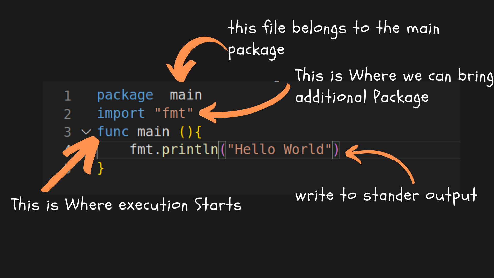
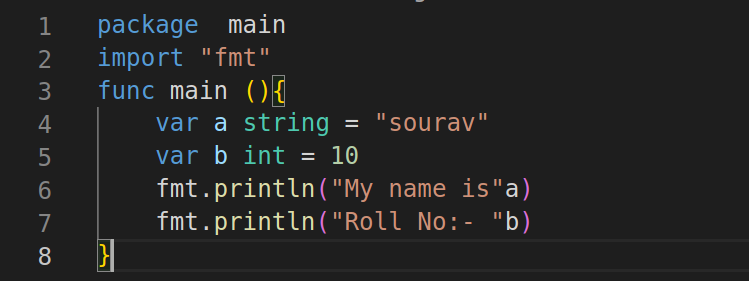

# Go lang

You have to have a basic language. In DevOps or Backend servers python is used the most but GO is used in most backend software. But you have the learned Python you don't have to learn to go lang. So if you are interested in Go lang then let's Go 

#Why Go

Go lang is the next programming language for DevOps. DevOps tools and platforms are written in Go such as Kubernetes, Docker, and Prometheus. Go is compiled directly into machine code. Go is known also for fast compilation times.

#Go VS Python for DevOps

Go Program is statically linked this means that when you compile a go program everything is included in a single binary executable no external dependencies will be required that would need to be installed on the remote machine. That makes deployment with GO easy. Compare to python where external libraries need to be installed on the remoter machine 

Go is a Platform independent language.

As you can see this is how the compiler work that makes it first.

Let's write our first program in Go lang that is very simple

This is our first program as you can see from the image I have explained. Let's see another example of the GO program

So this is very basic as we see it contains all the other aspects that a programming language should have. In this, I Will only introduce you to Go Lang 

#To Know More
